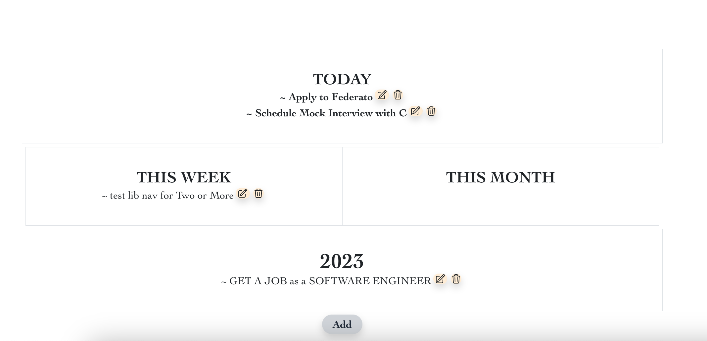

# JobSurge ⚡
[Server Repo](https://github.com/gnieb/jobwave-server)




## About
**SURGE [ v ]:** 
**to move suddenly and powerfully forward or upward.** 

This application is a career dashboard. It was originally developed to help me get a job at a company I REALLY wanted to work for, but at that time, they didn't have the jobs posted that fit my qualifications. 
=> **Enter JobSurge.**
I needed to develop a career dashboard to help me navigate my job search, organize my priorities, and categorize my goals by Day, Week, Month, and Year. JobSurge was built to navigate my transition from Human Resources into tech. 

### Built With

* 
* 
* 

## Features In Progress


## Features Completed 


- Home Page created with placeholder encouraging quotes and reminders 
- Jobs Page created with job placeholders, waiting for web scraper data
- Ability to add more advice collected from different developers to the collection of wisdom I've gathered.
- SVG lightning icon
- TO DO FEATURE: Career search to-do's displayed by priority timeframe, with full CRUD actions:

- - able to cross it off for the dopamine hit and show everything you got done that day. 
- - able to remove a to do completely from dashboard when complete


## Usage

### Installation
1. Fork and Clone this repo and the back-end repo
   ```sh
   git clone https://github.com/gnieb/jobwave
   git clone https://github.com/gnieb/jobwave-server 
   ```

2. CD into client directory and install npm packages
    ```sh
    cd client
    ```
    ```sh
    npm install
    ```
3. Start the Application
    ```sh
    npm start
    ```
4. Create Server virtual environment 
    ```sh
    pipenv install
    pipenv shell
    ```
5. Start the server
    ```sh
    python app.py
    ```

## Features in Progress
- implement default theme via CSS config
- implement loading state for the JOBS page... the web driver takes ignificant time and resources to pull the data, and I want a nice user experience that shows it's doing something! 


**Note:** Selenium uses the binary driver to control the web browser of choice. This Python package provides binary drivers for the following supported web browsers: Chrome, Chromium, Brave, Firefox, IE, Edge, and Opera. Note that Safari is not supported.